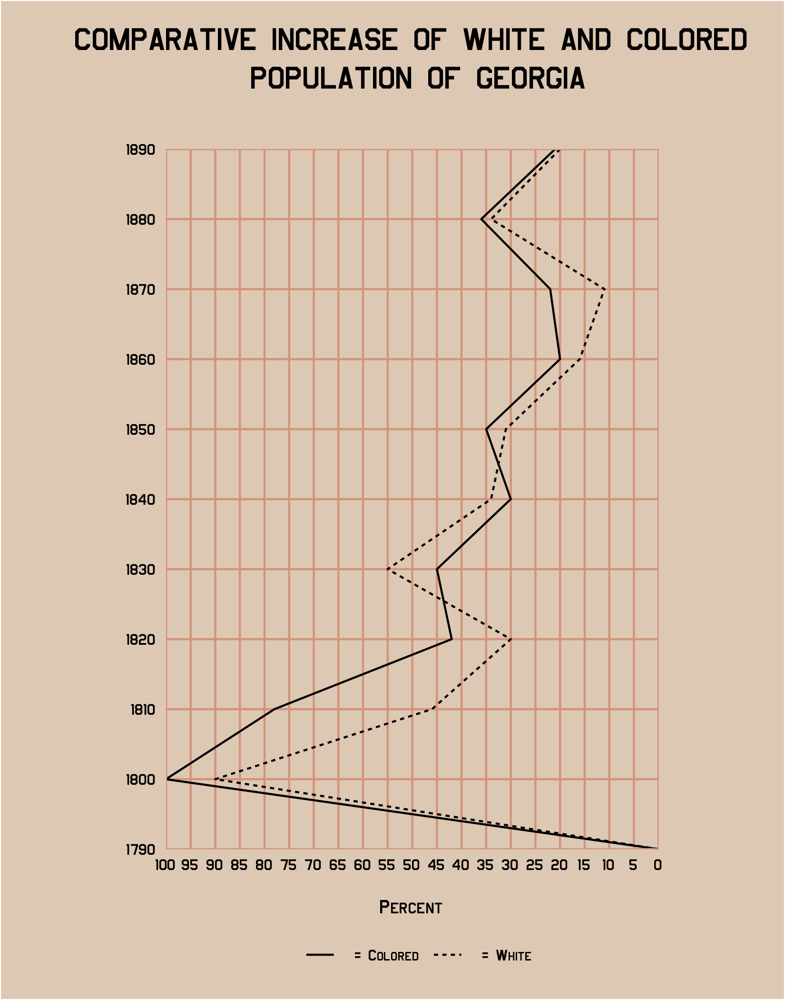
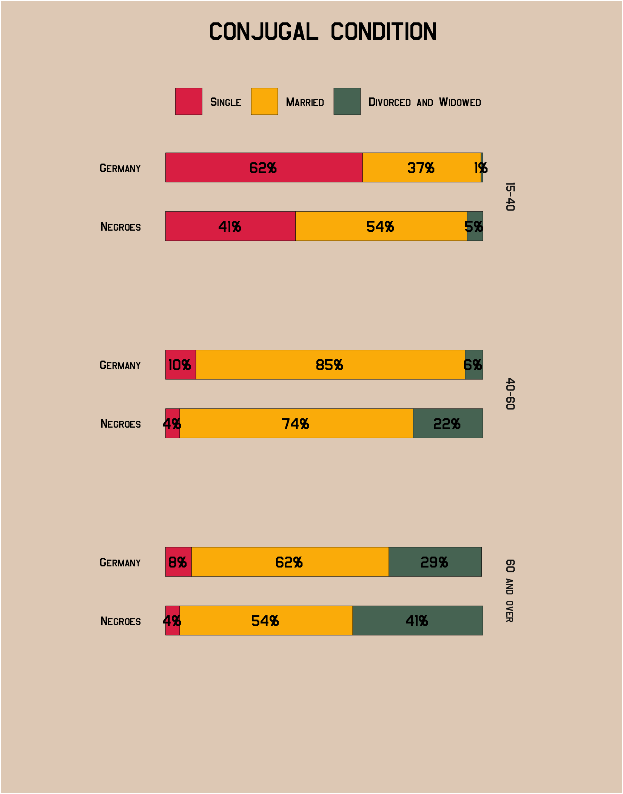
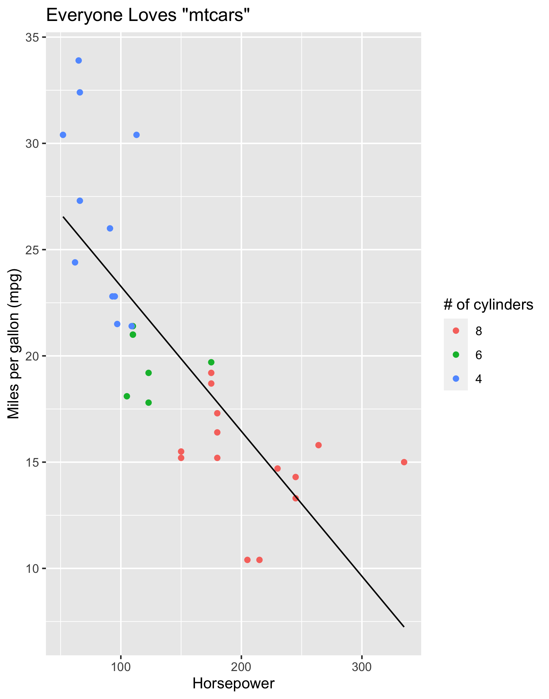
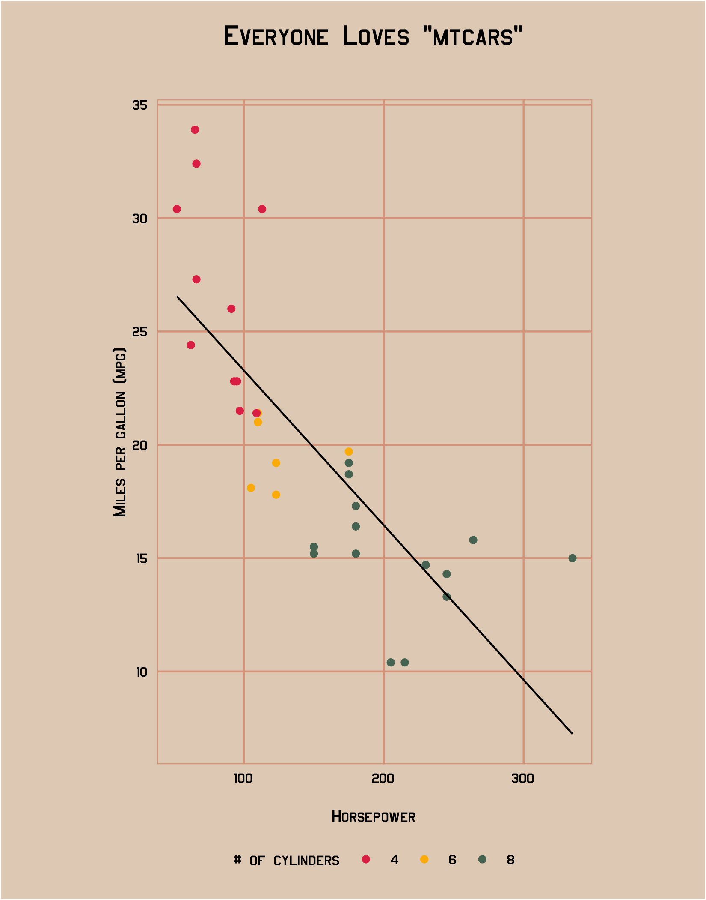

# themedubois

Simple Theme for `ggplot2` Based on [W.E.B. Du Bois' Data Visualizations](https://www.smithsonianmag.com/history/first-time-together-and-color-book-displays-web-du-bois-visionary-infographics-180970826/).

-----
## Install 

To install from Github, use the `devtools` package,

```r
## Install package
devtools::install_github("vladmedenica/themedubois")

## Load package
library(themedubois)
```
## Overview

Inspired by the excellent posts tagged [#DuBoisChallenge](https://twitter.com/search?q=%23DuBoisChallenge&src=typed_query) and Dr. Charlie Eaton's custom [Stata scheme](https://twitter.com/CharlieEatonPhD/status/1362882278230093824), this basic package offers a very simple ggplot2 theme that mimics the overall look of W.E.B. Du Bois' Data Portraits. 

The core theme, `theme_dubois()`, is built using the [Jefferies](https://www.1001freefonts.com/jefferies.font) font, which can be downloaded and installed for free using the [`extrafonts`](https://github.com/wch/extrafont) package. This font is a rough, but nowhere near perfect, approximation of the font style used in Du Bois' original data portraits.

Also included are two color palettes, which can be accessed using the following functions:

  - `scale_color_dubois1()` & `scale_fill_dubois1()`: Discrete color scale that includes a palatte of 7 colors inspired by [plate #25](https://github.com/ajstarks/dubois-data-portraits/blob/master/challenge/challenge07/original-plate-25.jpg?raw=true)
  - `scale_color_dubois2()` & `scale_fill_dubois2()`: Discrete color scale that includes a palatte of 3 colors inspired by [plate #10](https://github.com/ajstarks/dubois-data-portraits/blob/master/plate10/original-plate-10.jpg?raw=true) 
    palette
 
 ## Examples
 
 ### Example #1
 
```r
## Load the tidytuesday package to access Du Bois data
 library(tidytuesdayR)
 tt <- tt_load("2021-02-16")
 
## Load tidyverse and themedubois packages
 library(tidyverse)
 library(themedubois)
 
## Load and wrangle the GA population dataset
 ga_pop_dat <- tt$georgia_pop %>% 
  pivot_longer(-Year, names_to = "Race", values_to = "pct") %>% 
  mutate(Race = glue::glue(" = {Race}"))

## Replicate the line graph using theme_dubois()
ggplot(ga_pop_dat, aes(y = pct, x = Year, group = Race, linetype = Race)) +
  geom_line(size = 0.5) +
  # reverse the y-axis and format breaks
  scale_y_reverse(breaks = seq(0, 100, 5),
                  expand = c(0, 0)) +
  # format x-axis breaks
  scale_x_continuous(breaks = seq(1790, 1890, 10),
                     expand = c(0, 0)) +
  # add plot title and labels
  labs(linetype = NULL,
       y = "Percent",
       x = NULL,
       title = "COMPARATIVE INCREASE OF WHITE AND COLORED\n POPULATION OF GEORGIA") +
  # apply theme_dubois()
  theme_dubois() + 
  # flip plot coordinates to match original
  coord_flip()
```
<table>
  <tr>
    <th>Original</th>
    <th>Using theme_dubois()</th> 
  </tr>
  <tr>
    <th></th>
    <th></th>
  </tr>
</table>
  
### Example #2

```r
## Load the tidytuesday package to access Du Bois data
 library(tidytuesdayR)
 tt <- tt_load("2021-02-16")
 
## Load tidyverse and themedubois packages
 library(tidyverse)
 library(themedubois)
 
## Load and wrangle the conjugal dataset
conjugal_data <- tt$conjugal %>% 
  # put the data in tidy format
  pivot_longer(cols = c(-Population, -Age), names_to = "Status", values_to = "Percent") %>% 
  # adjust the Population variable and create percentage labels
  mutate(Population = factor(Population),
         Population = fct_rev(Population),
         pct_label = paste0(round(Percent), "%"))

## Replicate the stacked bar graph using theme_dubois()
ggplot(conjugal_data, aes(x = Percent, y = Population, fill = Status)) +
  # stack the columns
  geom_col(position = position_stack(),
           width = 0.5,
           color = "black",
           size = 0.1) +
  # add percentage labels
  geom_text(aes(label = pct_label), 
            position = position_stack(vjust = 0.5),
            size = 4,
            family = "Jefferies") +
  # arrange in single column
  facet_grid(vars(Age)) +
  # add plot labels
  labs(title = "CONJUGAL CONDITION",
       fill = NULL,
       x = NULL,
       y = NULL) +
  # use the correct color palette
  scale_fill_dubois2() +
  # add theme_dubois
  theme_dubois() +
  # adjust a few theme elements that are specific to this replication
  theme(legend.position = "top",
        panel.grid.major = element_blank(),
        panel.border = element_blank(),
        plot.margin = margin(0.5, 2.25, 3, 2.25, "cm"),
        panel.spacing.y = unit(3, "lines"),
        axis.text.x = element_blank())
```
<table>
  <tr>
    <th>Original</th>
    <th>Using theme_dubois()</th> 
  </tr>
  <tr>
    <th></th>
    <th></th>
  </tr>
</table>

### Example #3

```r
## Load tidyverse
library(tidyverse)

## The classic mtcars plot
mpg <- ggplot(data = mtcars, aes(x = hp, y = mpg, color = fct_rev(factor(cyl)))) +
         geom_point() +
         geom_smooth(method = "lm", se = FALSE, 
                     color = "black", size = 0.5) +
         labs(title = "Everyone Loves \"mtcars\"",
              color = "# of cylinders",
              x = "Horsepower",
              y = "Miles per gallon (mpg)")

## Add Du Bois theme and color palette           
mpg + 
  scale_color_dubois2() +
  theme_dubois()
```
<table>
  <tr>
    <th>Default theme_grey()</th>
    <th>Using theme_dubois()</th> 
  </tr>
  <tr>
    <th></th>
    <th></th>
  </tr>
</table>
