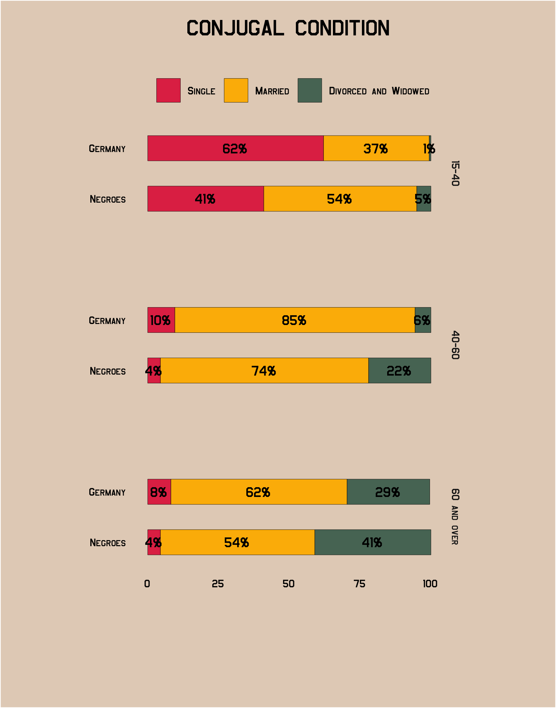

# themedubois

Simple Theme for `ggplot2` Based on [W.E.B. Du Bois' Data Visualizations](https://www.smithsonianmag.com/history/first-time-together-and-color-book-displays-web-du-bois-visionary-infographics-180970826/).

-----
## Install 

To install to from Github, use the **devtools** package,

```r
devtools::install_github("vladmedenica/themedubois")
```
## Overview

This is a very focused package that provides typography-centric themes
and theme components for ggplot2. It’s a an extract/riff of
[`hrbrmisc`](https://github.com/hrbrmstr/hrbrmisc) created by request.

The core theme: `theme_ipsum` (“ipsum” is Latin for “precise”) uses
Arial Narrow which should be installed on practically any modern system,
so it’s “free”-ish. This font is condensed, has solid default kerning
pairs and geometric numbers. That’s what I consider the “font trifecta”
must-have for charts. An additional quality for fonts for charts is that
they have a diversity of weights. Arial Narrow (the one on most systems,
anyway) does not have said diversity but this quality is not (IMO) a
“must have”.

The following functions are implemented/objects are exported:

Themes:

  - `theme_dubois`: Uses the Jeffries font (https://www.1001freefonts.com/jefferies.font)

Scales:

  - `scale_color_dubois1`: Discrete color scale that includes a palatte of 7 colors based on plate # W.E.B Du Bois' 
  - `scale_color_dubois2`: Discrete color & fill scales based on the ipsum
    palette
  - `scale_fill_dubois1`: Discrete color & fill scales based on the ipsum
    palette
  - `scale_fill_dubois2`: Discrete color & fill scales based on the ipsum
    palette
 
 ## Examples
 
 ### Example #1
 
```r
# Load the tidytuesday package to access Du Bois data
 library(tidytuesdayR)
 
# Load and wrangle the GA population dataset
 ga_pop_dat <- tt$georgia_pop %>% 
  pivot_longer(-Year, names_to = "Race", values_to = "pct") %>% 
  mutate(Race = glue::glue(" = {Race}"))

# Replicate the line graph using theme_dubois()
ggplot(ga_pop_dat, aes(y = pct, x = Year, group = Race, linetype = Race)) +
  geom_line(size = 0.5) +
  scale_y_reverse(breaks = seq(0, 100, 5),
                  expand = c(0, 0)) +
  scale_x_continuous(breaks = seq(1790, 1890, 10),
                     expand = c(0, 0)) +
  labs(linetype = NULL,
       y = "Percent",
       x = NULL,
       title = "COMPARATIVE INCREASE OF WHITE AND COLORED\n POPULATION OF GEORGIA") +
  theme_dubois() + 
  coord_flip()
```
<table>
  <tr>
    <th>Original</th>
    <th>Using theme_dubois()</th> 
  </tr>
  <tr>
    <th></th>
    <th></th>
  </tr>
</table>
  
### Example #2

```r
## Load the tidytuesday package to access Du Bois data
 library(tidytuesdayR)
 
## Load and wrangle the conjugal dataset
conjugal_data <- tt$conjugal %>% 
  # put the data in tidy format
  pivot_longer(cols = c(-Population, -Age), names_to = "Status", values_to = "Percent") %>% 
  # adjust the Population variable and create percentage labels
  mutate(Population = factor(Population),
         Population = fct_rev(Population),
         pct_label = paste0(round(Percent), "%"))

## Replicate the stacked bar graph using theme_dubois()
ggplot(conjugal_data, aes(x = Percent, y = Population, fill = Status)) +
  # stack the columns
  geom_col(position = position_stack(),
           width = 0.5,
           color = "black",
           size = 0.1) +
  # add percentage labels
  geom_text(aes(label = pct_label), 
            position = position_stack(vjust = 0.5),
            size = 4,
            family = "Jefferies") +
  # arrange in single column
  facet_grid(vars(Age)) +
  # add plot labels
  labs(title = "CONJUGAL CONDITION",
       fill = NULL,
       x = NULL,
       y = NULL) +
  # use the correct color palette
  scale_fill_dubois2() +
  # add theme_dubois
  theme_dubois() +
  # adjust a few theme elements that are specific to this replication
  theme(legend.position = "top",
        panel.grid.major = element_blank(),
        panel.border = element_blank())
```
<table>
  <tr>
    <th>Original</th>
    <th>Using theme_dubois()</th> 
  </tr>
  <tr>
    <th></th>
    <th></th>
  </tr>
</table>
